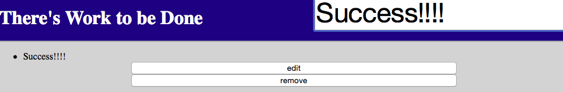

# todolist
Check that off the list with this todo list I created.

## How It's Made:

**Tech used:** HTML, CSS, JQuery

A to do list for you to check, edit, and delete things needed to be done for the day, week, month, or year.

## Lessons Learned:

I heard this was a great skill to have as a developer so i decided to give it a try. Though this was early on with my first application using javascript this was very exciting to create. Used icons and click events I made a todo list equipped with all the tools to help keep you on track.
